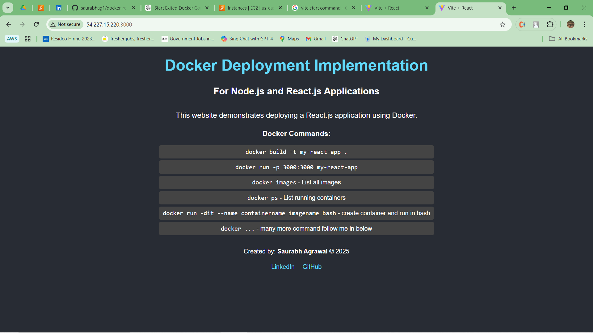

# React + Vite

# React App Docker Deployment

This repository demonstrates how to deploy a React.js application using Docker on an EC2 instance.

## Steps to Build and Run the Docker Container

### 1. **Rebuild the Docker Image**
After making necessary changes to the Dockerfile, rebuild the Docker image with the following command:
docker build -t my-react-app

### 2. **Run the Docker Container**
docker run -d -p 3000:3000 --name react-container my-react-app

### 3. **Access the App*
http://EC2-Public-IP:3000

This template provides a minimal setup to get React working in Vite with HMR and some ESLint rules.

Currently, two official plugins are available:

- [@vitejs/plugin-react](https://github.com/vitejs/vite-plugin-react/blob/main/packages/plugin-react/README.md) uses [Babel](https://babeljs.io/) for Fast Refresh
- [@vitejs/plugin-react-swc](https://github.com/vitejs/vite-plugin-react-swc) uses [SWC](https://swc.rs/) for Fast Refresh
